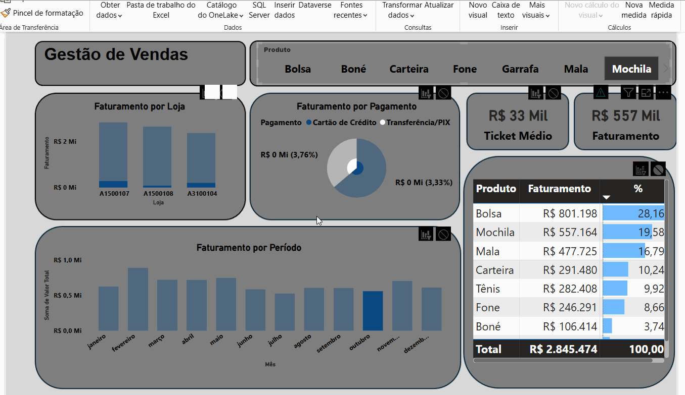

# Portfólio de Projetos Power BI

Bem-vindo(a) ao meu portfólio de projetos Power BI! Este repositório foi criado para demonstrar minhas habilidades em análise de dados, visualização e criação de dashboards interativos utilizando o Microsoft Power BI.

## Sobre Mim

Tenho experiência em logística e gestão de pessoas, busco contribuir no desenvolvimento e otimização de processos em ambientes portuários e na indústria Offshore e Onshore. Possuo atuação comprovada em gestão de estoque, armazenagem, distribuição, inventário, picking e packing e logística reversa. Minha experiência em logística somada às habilidades técnicas de utilização de Power BI, IA Generativa, Canvas, GitHub e Excel me permitem implementar metodologias como Lean Manufacturig e Just In Time, com objetivo de aprimorar operações logísticas desde a cadeia de suprimentos a distribuição e transporte.
Em minhas experiências profissionais anteriores, como líder operacional e assistente logístico, tive a oportunidade de colaborar no funcionamento de um centro de distribuição utilizando sistema ERP, e gerenciar estrategicamente a alocação de recursos humanos, utilizando principalmente o Microsoft Excel.

Contatos atualizados: 
WhatsApp: (21) 97730-5253
E-mail: miltonnetop@gmail.com

## Projetos

Abaixo, você encontrará uma lista dos projetos que desenvolvi em Power BI. Cada projeto inclui uma breve descrição, as principais habilidades demonstradas e, quando aplicável, um link para o dashboard interativo.

### Projeto 1: DashBoard - Gestor de Vendas

**Descrição do Projeto:**

O principal objetivo deste dashboard é fornecer uma visão geral e concisa da performance de vendas de uma empresa fictícia, permitindo a identificação de tendências, a comparação entre categorias de produtos e a compreensão da contribuição de cada elemento para o desempenho geral.

Especificamente, o dashboard busca responder às seguintes perguntas:

* **Faturamento Total:** Qual o faturamento total da empresa? (Visualizado através de um cartão)
* **Tendência de Vendas:** Como as vendas evoluíram ao longo do tempo? (Visualizado através de um gráfico de linhas mostrando a evolução mensal)
* **Participação por Categoria:** Qual a participação de cada categoria de produto no faturamento total? (Visualizado através de um gráfico de pizza ou de barras)
* **Desempenho por Região:** Qual o desempenho de vendas por região? (Visualizado através de um mapa ou gráfico de barras mostrando as vendas por estado)
* **Principais KPIs:** Quais são os principais indicadores de desempenho relevantes para a análise de vendas? (Incluindo faturamento total, lucro total, quantidade de vendas, etc.)

**Habilidades de Power BI Demonstradas:**

* **Conexão a Fontes de Dados:** Demonstração da conexão do Power BI a uma fonte de dados externa (ex: arquivo Excel).
* **Power Query (Carregamento e Transformação de Dados):** Utilização do Power Query para importar e preparar os dados para análise.
* **Modelagem de Dados:** Criação de relacionamentos entre tabelas e estruturação do modelo de dados.
* **Criação de Medidas DAX:** Desenvolvimento de medidas personalizadas utilizando a linguagem DAX (ex: `TOTAL FATURAMENTO`).
* **Criação de Visualizações:** Implementação de diversos tipos de visuais para representar os dados de forma eficaz:
    * **Cartões (Cards):** Para exibir métricas chave de forma destacada.
    * **Gráfico de Linhas:** Para visualizar tendências temporais.
    * **Gráfico de Pizza / Barras Empilhadas:** Para comparar a participação de diferentes categorias.
    * **Mapa:** Para análise geográfica dos dados.
* **Formatação de Visuais:** Personalização da aparência dos gráficos e cartões para melhor clareza e estética.
* **Criação e Organização do Dashboard:** Layout e organização dos visuais em um painel informativo e intuitivo.
* **Interação Básica (Filtros):** Implementação de filtros para permitir a exploração interativa dos dados.

**Link para o Dashboard:** https://linksharing.samsungcloud.com/dhtBw34jGbYf

**Imagens/GIFs:** 
